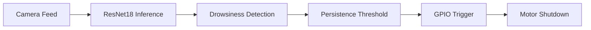
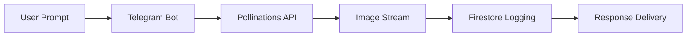

<div align="center">

# Potnuru Mohith

### Fullstack & Embedded Systems Developer


<br/>


</div>

---

# SYSTEM PROFILE

```yaml
Name: Potnuru Mohith

Role:
  - Fullstack Developer
  - Embedded Systems Developer

Focus Areas:
  - Edge AI Systems
  - Real-Time Computer Vision
  - Backend Architecture
  - Embedded Automation
  - AI Workflow Engineering

Engineering Direction:
  Building AI systems that interact with
  real-world hardware under latency constraints.
```

---

# ENGINEERING DOMAINS

| Domain | Focus |
|---|---|
| Edge AI | Real-time inference on constrained hardware |
| Computer Vision | Gesture tracking & drowsiness detection |
| Backend Systems | Async pipelines & orchestration |
| Embedded Automation | GPIO-based execution systems |
| AI Systems | Practical deployment-oriented AI workflows |

---

# FEATURED PROJECTS

---

<div align="center">

```txt
[ SYSTEM 01 ]
TOUCHLESS GESTURE MEDIA CONTROL
```


</div>


### Engineering Notes

```yaml
Problem:
  Eliminate physical interaction using real-time gesture control.

Core Challenge:
  Maintaining stable gesture recognition under
  strict low-latency execution limits.

Key Engineering Decision:
  Implemented 3-frame temporal confirmation
  to reduce false positives without sacrificing
  responsiveness.

Stack:
  - Python
  - OpenCV
  - MediaPipe
  - Jetson Nano
```

<a href="https://github.com/mohith789p/touchless-media-controller">
  
</a>

---

<div align="center">

```txt
[ SYSTEM 02 ]
DRIVER DROWSINESS CONTROLLER
```


</div>



### Engineering Notes

```yaml
Problem:
  Prevent fatigue-induced vehicular accidents.

Core Challenge:
  Avoiding inference lag and false shutdown triggers
  during real-time execution.

Key Engineering Decision:
  Engineered deterministic 2-frame persistence
  threshold for low-latency safety response.

Stack:
  - PyTorch
  - CUDA
  - OpenCV
  - Jetson.GPIO
```

<a href="https://github.com/mohith789p/Nvidia">
  
</a>

---

<div align="center">

```txt
[ SYSTEM 03 ]
PICGENERATION BOT
```


</div>



### Engineering Notes

```yaml
Problem:
  Simplify access to AI image generation workflows.

Core Challenge:
  Handling multi-stage async failures without
  hanging user sessions or exhausting memory.

Key Engineering Decision:
  Built centralized async error interception
  with stream-based binary routing.

Stack:
  - Node.js
  - Axios
  - Firebase
  - Telegram Bot API
```

<a href="https://github.com/mohith789p/Telegram-Bot">
  
</a>

---
---

# TECH STACK

<div align="center">

### Languages


### Backend & Systems


### AI / CV / Embedded


</div>

---

# SELECTED REPOSITORIES

| Repository | Description |
|---|---|
| [Nvidia](https://github.com/mohith789p/Nvidia) | Jetson Nano setup & edge AI experiments |
| [Telegram-Bot](https://github.com/mohith789p/Telegram-Bot) | AI-powered Telegram bot collection |
| [touchless-media-controller](https://github.com/mohith789p/touchless-media-controller) | Real-time gesture-controlled media system |
| [Attend](https://github.com/mohith789p/Attend) | Attendance monitoring system |
| [Tic-Tac-Toe-Game](https://github.com/mohith789p/Tic-Tac-Toe-Game) | CLI-based game system |

---

# TECHNICAL ACTIVITY

## LinkedIn Engineering Posts

<table>
<tr>
<td width="50%">

### 🧠 Computer Vision / Edge AI

<a href="https://www.linkedin.com/posts/potnuru-mohith_computervision-machinelearning-edgeai-ugcPost-7409606305285603328-C53N/">
  
</a>

Real-time Edge AI experimentation using computer vision pipelines on NVIDIA Jetson hardware.

</td>

<td width="50%">

### 🚗 Driver Drowsiness Controller

<a href="https://www.linkedin.com/posts/lakshmi-sai-ram-rathipalli-172109353_theengineersmindset-theengineersmindset-studentinnovator-ugcPost-7438908753846120448-d1jX/">
  
</a>

Edge AI fatigue detection system integrating ResNet-18 inference with real-time GPIO execution logic.

</td>
</tr>

<tr>
<td width="50%">

### ✋ Touchless Gesture System

<a href="https://www.linkedin.com/posts/potnuru-mohith_git-github-workshop-activity-7374072308979793920-12Nc/">
  
</a>

Computer vision-based touchless interaction system designed for gesture-driven media execution.

</td>

<td width="50%">

### 🛠 Git & GitHub Workshop

<a href="https://www.linkedin.com/posts/potnuru-mohith_softwareengineering-java-objectorienteddesign-activity-7420111541670182913-xpp4/">
  
</a>

Conducted technical knowledge-sharing session on Git workflows and version control fundamentals.

</td>
</tr>
</table>

---

# GITHUB ANALYTICS

<div align="center">


</div>

---

# CONTRIBUTION GRAPH

<div align="center">


</div>

---

# CONNECT

<div align="center">

<a href="mailto:mohith321p@gmail.com">
  
</a>

<a href="https://www.linkedin.com/in/potnuru-mohith">
  
</a>

<a href="https://leetcode.com/u/mohith789p/">
  
</a>

</div>

---

<div align="center">

```txt
Designing systems where AI doesn't just predict —
it interacts, responds, and executes in real time.
```

</div>
